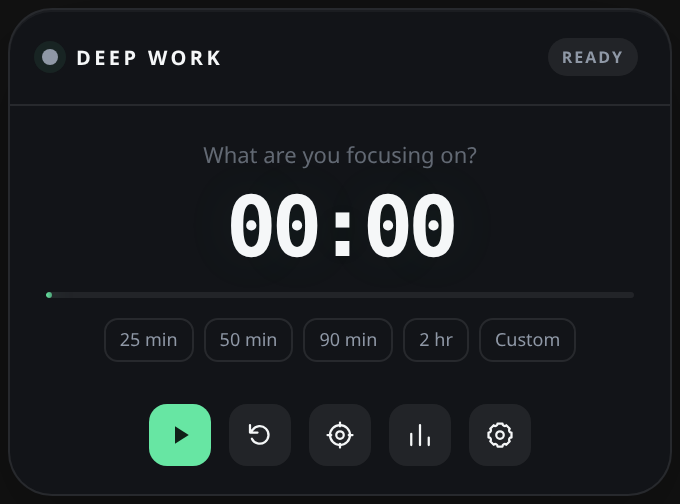

# DeepHUD

**DeepHUD is a privacy-first, distraction-free focus timer for Windows, macOS, and Linux.**

Stay focused on deep work without accounts, cloud sync, telemetry, or tracking.

[Website](https://hktjayaranga.github.io/deephud/) ·
[Download](https://github.com/hktjayaranga/deephud/releases/latest) ·
[Privacy](docs/PRIVACY.md)



## Features

- Floating transparent HUD with compact/full layouts and three sizes
- Stopwatch, countdown, Deep Work, Pomodoro, and custom work/break intervals
- Pause, resume, reset, skip, and ±5-minute adjustment
- Optional break activities: choose guided square breathing or continue with a normal break
- Themes, custom accent, opacity, always-on-top, snapping, and click-through
- Projects, tasks, editable history, daily/weekly statistics, goals, and streaks
- Today’s task queue with ordering, session estimates, completion, carry-forward, and next-task choices
- Distraction capture with a global shortcut, optional break review, and conversion to Today’s queue
- CSV/JSON export plus complete JSON backup and restore
- Configurable global shortcuts and system-tray controls
- Desktop notifications, completion sounds, warnings, and native idle handling
- Global focus audio with real rain and calm-waterfall recordings, local audio files, instant previews, and remembered volume
- Start on login, close to tray, and native installers for all three desktop platforms
- Offline-only SQLite storage with no tracking

## Install a release

Download the installer for your operating system from the
[latest GitHub release](https://github.com/hktjayaranga/deephud/releases/latest):

- Linux x64: `.deb` or AppImage
- Windows x64: NSIS setup `.exe` or `.msi`
- macOS Apple Silicon: `aarch64.dmg`
- macOS Intel: `x86_64.dmg`

Every release also contains `SHA256SUMS` for verifying the downloads.

Debian package:

```bash
sudo apt install './DeepHUD_1.0.0_amd64.deb'
```

AppImage:

```bash
chmod +x 'DeepHUD_1.0.0_amd64.AppImage'
./DeepHUD_1.0.0_amd64.AppImage
```

The `.deb` installs the application icon and desktop entry. On Windows, run
either installer and launch DeepHUD from the Start menu. On macOS, open the
matching DMG and drag DeepHUD into Applications.

## Build from source

Install the prerequisites for your OS from the
[Tauri prerequisites guide](https://v2.tauri.app/start/prerequisites/). On
Ubuntu/Debian, the native packages are:

```bash
sudo apt update
sudo apt install -y build-essential curl wget file libwebkit2gtk-4.1-dev \
  libgtk-3-dev libayatana-appindicator3-dev librsvg2-dev libssl-dev pkg-config
```

Install Rust stable and Node.js 20 or newer, then:

```bash
npm ci
npm run tauri dev
```

Build the native packages for the current operating system:

```bash
npm run tauri build
```

Artifacts are written beneath `src-tauri/target/release/bundle/`.

## Usage

Use a quick-duration button on the HUD, or select the **Focus** button next to Reset to prepare
a Deep Work/Pomodoro session with a project and task. **More → Dashboard** opens
the productivity dashboard. **More → Settings** opens appearance, timer,
integration, alert, idle, goal, and shortcut settings.

Completed work intervals are recorded; breaks do not inflate focus totals. The
History page can search, filter, edit, delete, export, back up, and restore data.
Choose CSV or JSON, then **Export filtered results** to export the current search,
project, and local-date matches, or **Export all history** for every record.
Export counts refer to individual focus intervals, including partial work.

Use **History → Delete data…** to choose which categories to remove: focus
history, queued tasks, saved thoughts, schedules and reminders, or project/task
suggestions. Nothing is selected by default. The dialog summarizes the checked
categories before **Delete selected categories**; deletion includes all dates,
regardless of history filters. Unchecked categories, settings, and audio recordings
are kept. Deleting history resets focus totals and linked task session progress;
deleting suggestions keeps project/task names on existing records. Individual
interval, task, thought, schedule, and recording deletes remain available.


Under **Settings → Focus policy → When computer is idle**, choose **Keep counting**,
**Pause** (resume manually), or **Pause and resume automatically** when input returns.
The idle threshold applies to either pause option. Desktop idle checks run every
15 seconds; time before the timer pauses remains counted.

### Monthly insights

In **Dashboard → Overview**, switch **Week / Month** below the daily summary.
Month shows total focused time, completed focus blocks, active days, a daily
calendar heatmap, project comparisons, and **Focus time by session start hour**.
Use Previous month / Next month / This month to browse saved history.

- Partial and untimed sessions contribute focused time, but do not count as
  completed focus blocks. Older countdown records infer completion from their
  planned duration when explicit completion metadata is unavailable.
- Current-month comparisons use the same local day and time in the previous
  month, capped at its end if shorter. Historical comparisons use full months.
  A zero baseline shows a plain-language explanation rather than an infinite
  percentage.
- Calendar intensity is relative to that month's busiest day; each cell also
  shows focused time. Select a day to open History filtered to intervals that
  started on that local date. Empty days remain selectable; future days do not.
- All focused time is assigned to each saved interval's local start date/hour.
  This includes intervals spanning midnight or a month boundary. Hourly charts
  do not estimate the timing of pauses or claim exact hourly activity.
- Project totals include **Unassigned** work. Insights update from saved history
  after edits/deletions/restores and stay inside the scrollable dashboard.

### Today’s task queue

Open **Today’s task queue** from the full HUD, **Today** in the dashboard, or
**Today’s queue** in the session launcher. The queue button stays available
in the full HUD during a session.

- Add a task with an optional project, estimated session count, minutes per
  session, and Deep Work or Focus intervals mode. Use the arrows to arrange
  unfinished tasks, or Edit to change a task before starting it.
- Start launches that task using its saved duration. End & save an open session
  before starting a different task from the queue.
- Each completed work interval counts as one session. Partial work contributes
  to focused time without increasing the completed count. Estimates do not
  automatically mark tasks done; use the checkbox or **Mark task done**. Reopen
  completed tasks with the same checkbox.
- After Deep Work, choose to continue, mark the task done, switch to the next
  unfinished task in today’s order, or end the session. Focus intervals preserve
  their normal short/long breaks and offer this choice after the break, even
  when automatic work-start is enabled. Automatic break-start still applies.
- Unfinished tasks stay under **Unfinished from earlier** after midnight. Move
  them to today to keep their progress. Removing a task keeps its focus history.
- Queue items and their history links are stored locally and included in v4
  JSON backups (v2 queue backups remain readable). Existing v1 backups remain readable; restoring one replaces the
  queue with an empty queue. Database reset also clears the queue.

### Save a thought for later

Press **Ctrl+Alt+N** or select the capture icon beside the session name to open a small input
in the HUD. Type a thought and press Enter to save; Escape cancels. Capture does
not pause, restart, or replace the timer. The shortcut can be changed or cleared
under Settings → Keyboard shortcuts, with the same conflict reporting as other
shortcuts.

The shortcut brings a hidden/minimized HUD forward. Compact HUDs use the existing
full layout so the input fits. Click-through is temporarily suspended while the
input is open, then restored according to your current preference. Idle handling
is deferred while capturing and for the configured idle threshold after your
last capture interaction. A failed save keeps the draft and allows retry.

During a break, the header offers a subtle **saved · Review** button when thoughts
are pending. It opens the standalone **Saved for later** screen, also available
from **More controls → Saved for later** and Today’s **Saved thoughts** shortcut.
The subtle counts show unhandled thoughts. The screen matches Today and Schedule
with **Today** and **Back to timer** navigation. Review is optional and does not
overlay the breathing activity or start work. Saving a quick capture keeps you
on the timer without opening review.

- **Mark handled** moves a thought into Handled; Reopen returns it to review.
- **Keep for later** sets it aside until you reopen the list.
- **Add to Today** opens the usual task form with the thought pre-filled. Choose
  a project, duration, and session estimate, then save. The task stays queued;
  it does not start automatically. Repeated saves cannot create another task
  from the same thought, even if the original task was later removed.
- **Delete** removes only the thought; any task created from it is kept.

Saved thoughts persist in local SQLite storage and v4 JSON backups. v1/v2 backups
remain readable and restore an empty saved-thought list. Database reset also
clears saved thoughts.

### Focus audio

Open **More → Focus audio** from the full HUD to control focus sound for any Deep
Work, Pomodoro, quick-start, custom, countdown, or stopwatch session. Focus
audio is off by default and plays entirely on the device.

- Choose the included Heavy rain or Calm waterfall field recording,
  or add MP3, WAV, OGG, FLAC, M4A, or AAC files to an offline local library.
  User recordings are copied into DeepHUD's app-data folder and can be renamed
  or removed without changing the original files; built-in recordings remain
  protected.
- Select a recording while the timer is stopped to hear an eight-second
  preview. Choose another recording to switch previews, select the current one
  again to stop, or close the popover to end the preview.
- Change the active recording, volume, or mute state without stopping a running
  timer. Selecting Silence stops focus audio and remembers that choice.
- DeepHUD remembers the selected recording and volume, pauses audio with the
  timer, and stops it when the session ends or resets.

The Audio button is intentionally hidden in compact mode. Expand to the full
HUD to change focus-audio controls.

### Default shortcuts

| Action | Shortcut |
| --- | --- |
| Start / pause | `Ctrl+Alt+Space` |
| Reset | `Ctrl+Alt+R` |
| Show / hide HUD | `Ctrl+Alt+H` |
| Toggle click-through | `Ctrl+Alt+C` |
| Start default Deep Work | `Ctrl+Alt+S` |
| Save a thought for later | `Ctrl+Alt+N` |

Every shortcut can be changed in Settings. If a combination is already owned
by the desktop or another application, DeepHUD reports it as unavailable.
Click-through instructions show the currently registered shortcut. If it is
cleared or unavailable, use the system tray menu → **Turn off click-through**
to restore mouse interaction. This also turns off the saved click-through setting.

## Data and privacy

Focus history is stored locally in the operating system's application config
directory. Common locations are:

```text
Linux:   ~/.config/com.deepworkhud.app/deepwork-hud.db
Windows: %APPDATA%\com.deepworkhud.app\deepwork-hud.db
macOS:   ~/Library/Application Support/com.deepworkhud.desktop/deepwork-hud.db
```

There is no application network client, account, telemetry, cloud sync, or
automatic surveillance. See [the privacy document](docs/PRIVACY.md).

## Test

```bash
npm test
npm run build
cd src-tauri
cargo fmt --check
cargo check
```

See [desktop release testing](docs/TESTING.md), the
[release guide](docs/RELEASING.md), and [Ubuntu/Wayland notes](docs/UBUNTU.md).

## Project structure

```text
deepwork-hud/
├── .github/workflows/       # CI and tagged GitHub releases
├── docs/                    # privacy, compatibility, and testing
├── src/                     # React UI and application services
├── src-tauri/               # Tauri/Rust backend and package metadata
├── tests/                   # unit and integration tests
├── CHANGELOG.md
├── CONTRIBUTING.md
├── LICENSE
├── SECURITY.md
└── README.md
```

## Scope

Version 1.0 deliberately excludes accounts, cloud synchronization, mobile apps,
social/team features, website surveillance, and AI coaching. The application is
designed to help you focus—not become another service to manage.

Licensed under the [MIT License](LICENSE).


### Recurring focus schedules

Open **More controls → calendar button → Add schedule** to choose an activity, optional project,
weekdays, local time, and a Deep Work or Focus intervals plan. Interval schedules
save their work, short break, long break, and cycle settings. Each card can be
edited, enabled/disabled, or deleted. Schedule has its own screen with the same
layout and Back to timer navigation as Today. It stays accessible during active
sessions. Today also shows the next scheduled session and a Schedule shortcut.

DeepHUD must remain running (including in its tray) for reminders. The Rust
scheduler checks local wall time every ten seconds, independently of the HUD.
A notification opens the reminder in DeepHUD; **Start** uses the saved plan and
**Dismiss** skips just this occurrence. An active or paused session is never
replaced: use **Remind after session** to be notified once it ends. Pending
reminders can also be handled on the Schedule screen. Breathing activities retain
an optional review link instead of an automatic overlay.

Recent missed reminders are offered for up to 15 minutes; older ones expire.
Deferred reminders are kept for up to 24 hours. Repeated daylight-saving times
fire only at their first occurrence; nonexistent local times are skipped that
day. Occurrence keys prevent duplicate reminders after restarts or clock changes.
Editing a schedule clears its pending reminders and applies to future occurrences.
Operating-system notification permissions and Do Not Disturb can suppress system
alerts; pending reminders remain available inside DeepHUD.

Schedules and occurrence states are stored in SQLite and included in v4 backups.
Versions 1–3 remain readable and restore an empty schedule list. Database reset
also deletes schedules and reminder history. Browser development uses local
storage and browser notifications while its page is open; native background
scheduling is available in the desktop build.
